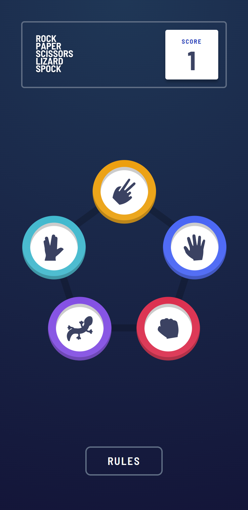
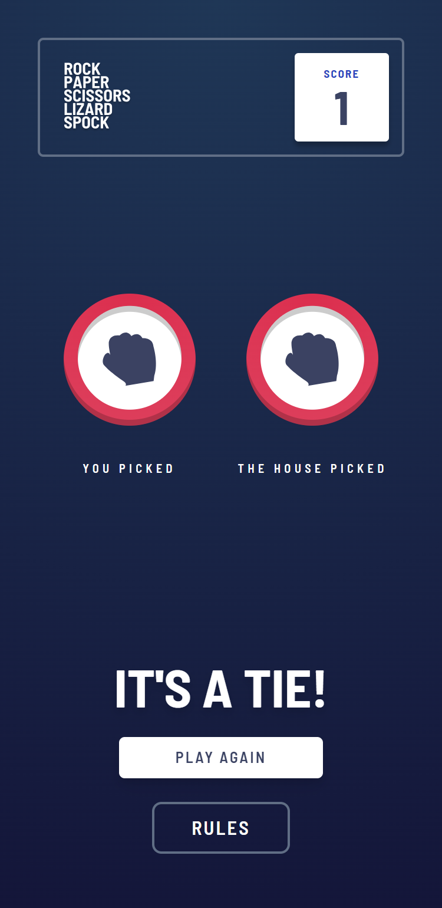
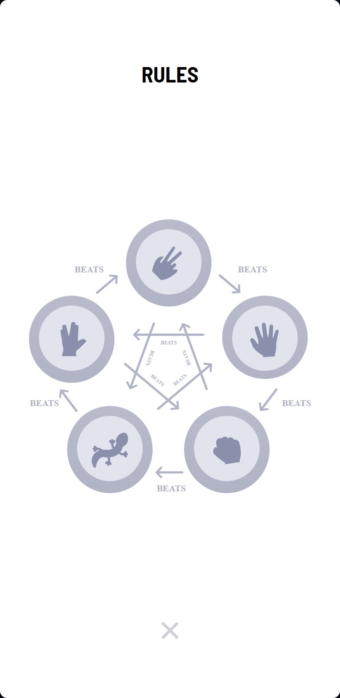

# Frontend Mentor - Rock, Paper, Scissors solution

This is a solution to the [Rock, Paper, Scissors challenge on Frontend Mentor](https://www.frontendmentor.io/challenges/rock-paper-scissors-game-pTgwgvgH). Frontend Mentor challenges help you improve your coding skills by building realistic projects.

## Table of contents

- [Overview](#overview)
  - [The challenge](#the-challenge)
  - [Screenshot](#screenshot)
  - [Links](#links)
- [My process](#my-process)
  - [Built with](#built-with)
  - [What I learned](#what-i-learned)
  - [Continued development](#continued-development)
  - [Useful resources](#useful-resources)
- [Author](#author)
- [Acknowledgments](#acknowledgments)

**Note: Delete this note and update the table of contents based on what sections you keep.**

## Overview

### The challenge

Users should be able to:

- View the optimal layout for the game depending on their device's screen size
- Play Rock, Paper, Scissors against the computer
- Maintain the state of the score after refreshing the browser _(optional)_
- **Bonus**: Play Rock, Paper, Scissors, Lizard, Spock against the computer _(optional)_

### Screenshot

### Links

- Solution URL: [Add solution URL here](https://your-solution-url.com)
- Live Site URL: [Play](https://rockpaperbonus.netlify.app/)

## My process

### Built with

- Mobile-first workflow
- [Tailwind](https://tailwindcss.com/) - CSS framework
- [Vite](https://vitejs.dev/) - build tool
- [React](https://reactjs.org/) - JS library
- [Framer](https://www.framer.com/motion/) - animation library

### What I learned

I used this project to get more familiar with Tailwind and Framer. In this experiment I end up with using Tailwind and Framer animations for different purposes. However the main goal was to get used with tailwind.

After I finished this project I realize that with Tailwind you can build something realy fast. React and Tailwind are great combo. All types of custom properties can be defined in the config file and the reused.
But with the Pros I noticed the Cons. For me that was when I wanted to change something in some of the components, the reading experience was really bad. There are simply a lot of utility classes and I can imagine that this can be realy good for building projects fast, but when it comes to change something, that can take a while.
If I have to compare it with the module.css or module.scss, probably I would still prefer the modules simply because they are easier to maintain and the classes can be significantly reduced.

But in the end of the day, the project determines the use.

## Author

- Website - [Plamen Petkov](https://plamspetkov.com/)
- Frontend Mentor - [@plamspetkov](https://www.frontendmentor.io/profile/plamspetkov)
